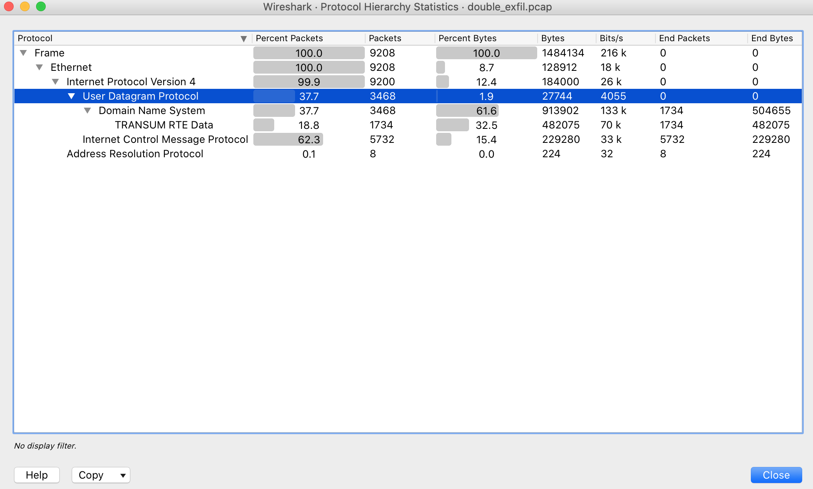

# Double Cheese : 250 points

Unfortunatly, I don't have the challenge description but this network capture, double_exfil.pcap, was given. A network capture can talk by itself ;)

### Let's open the network capture with wireshark and have a look at the protocol hierarchy statistics.



We can notice important protocol traffic that may have helped for data exiftrations like the 37.7% of DNS traffic and the 62.3% of ICMP traffic.

### A quick look at a possible ICMP exfiltration.


```shell
[CTF] $ tshark -r double_exfil.pcap -Y 'icmp' -Tfields -e data.data | uniq | cut -b17- | xxd -r -p | base64 -di > icmp.png
```

Note : I've cut each line's 16 first characters (cut -b17-) which correspond to noises amoung the exfiltrated data.<br>
This noises can be noticed with ease while inspecting hexadecimals exfiltrated data.

Here is a part of the flag. (The second one)


### The other part may be exfiltrated through DNS queries, let's have quick look at a possible DNS exfiltration with DNScat.

```shell
[CTF] $ tshark -r double_exfil.pcap -Y "dns.flags.response == 0" -T fields -e "dns.qry.name" | sed 's/\.exfil\.hacksecureims\.eu//g' | cut -b19- |sed 's/\.//g' | paste -sd" " - | sed 's/ //g' > dns_with_noises.hex
```

Note : I've cut each line's 18 first characters (cut -b19-) which correspond to noises amoung the exfiltrated data.<br>
This noises can be noticed with ease while inspecting hexadecimals exfiltrated data.<br><br>


I have opened the dns_with_noises.hex file with vim and have deleted the 50 first characters in order to have the correct PNG magic number.
The new file created is dns.hex

```shell 
[CTF] $ cat dns.hex | xxd -r -p > dns.png
[CTF] $ pngcheck -vt7f dns.png
```

Here is the other part of the flag. (The first one)


Here is the full flag.

<br>


<br/>


<br> Thanks to [m4khno](https://twitter.com/m4khno_) for this great challenge. <br/>

<br>


<br/>
