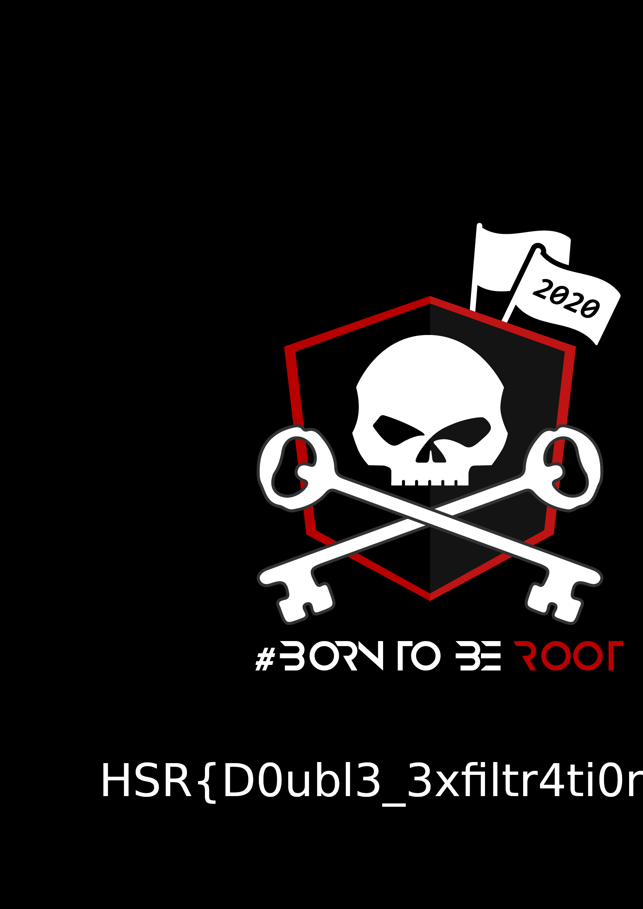

# Double Cheese : 250 points

Unfortunatly, I don't have the challenge description but this network capture, double_exfil.pcap, was given. A network capture can talk by itself ;)

Let's open the network capture with wireshark and have a look at the protocol hierarchy statistics.


We can notice important protocol traffic that may have helped for data exiftrations like the 37.7% of DNS traffic and the 62.3% of ICMP traffic.

A quick look at a possible ICMP exfiltration.
```shell
[CTF] $ tshark -r double_exfil.pcap -Y 'icmp' -Tfields -e data.data | uniq | xxd -r -p > icmp_with_noices.b64
```

I have opened the icmp_with_noices.b64 file with vim and have deleted all lines' 16 first characters, which representes noices in the ICMP exfiltration.
The new file created is icmp.b64

```shell 
[CTF] $ cat icmp.b64 | base64 -di > icmp.png
[CTF] $ pngcheck -vt7f icmp.png
```

Here is a part of the flag. (The second one)


The other part may be exfiltrated through DNS queries, let's have quick look at a possible DNS exfiltration.

```shell
[CTF] $ tshark -r double_exfil.pcap -Y 'dns' -Tfields -e dns.qry.name | uniq | tr -d ".exfil.hacksecureims.eu" > dns_with_noices.b64
```

I have opened the dns_with_noices.b64 file with vim and have deleted all lines' 18 first characters, which representes noices in the DNS exfiltration made certainly with DNScat.
The new file created is dns.b64

```shell 
[CTF] $ cat dns.b64 | base64 -di > dns.png
[CTF] $ pngcheck -vt7f dns.png
```

Here is the other part of the flag. (The first one)


