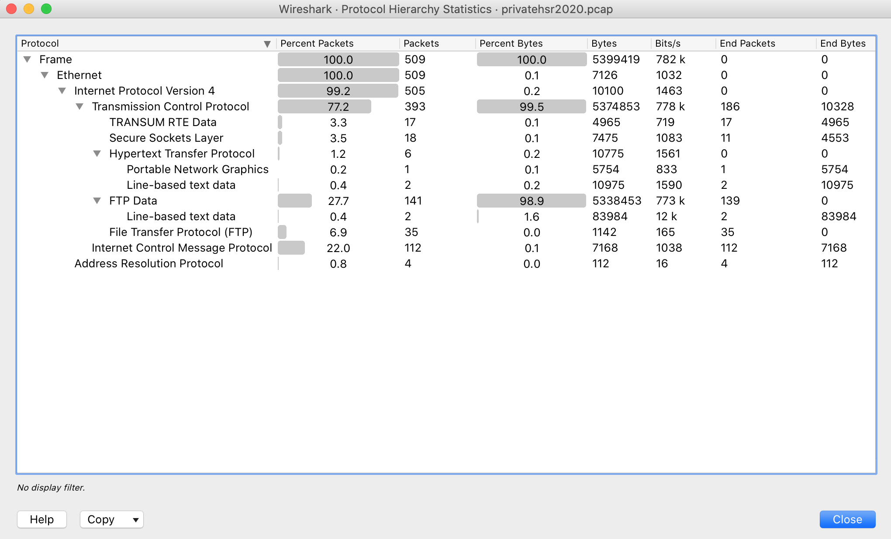
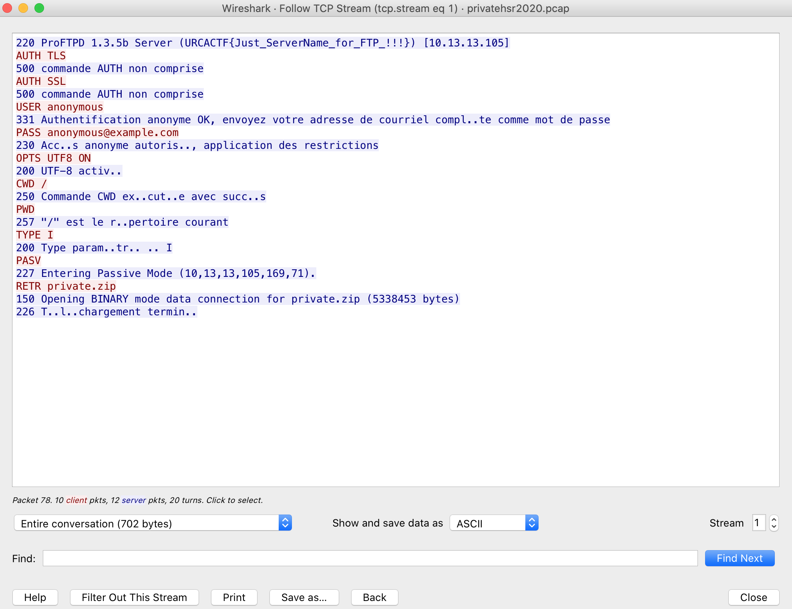
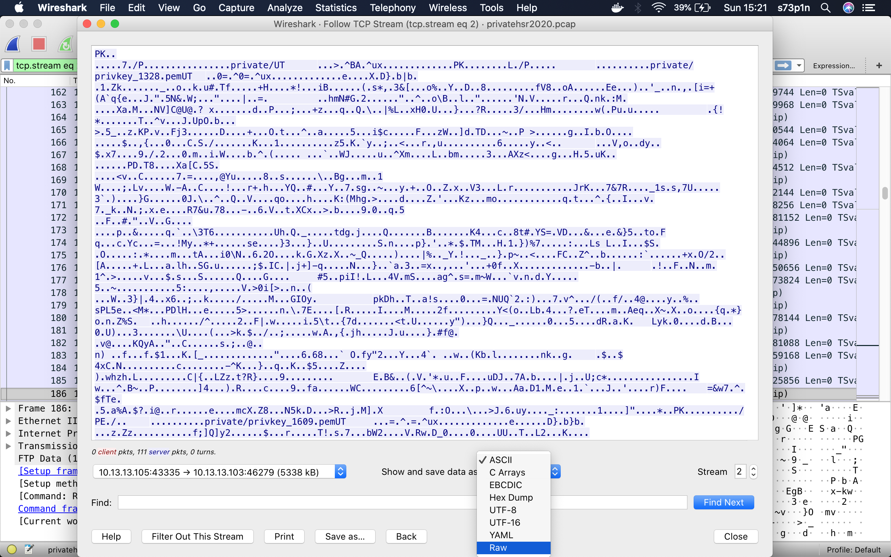

# Is so Private ? : 250 points

Unfortunatly, I don't have the challenge description but this network capture, privatehsr2020.pcap, was given. A network capture can talk by itself ;)

Let's open the network capture with wireshark and have a look at the protocol hierarchy statistics.



We can notice important protocol traffic that may have helped for data exiftrations like the 27.7% of FTP-data, the 6.9% of FTP traffic, the 22% of ICMP traffic and some encrypted TLSv1.2 traffics.

A quick look at a possible ICMP exfiltration.
```shell
[CTF] $ tshark -r privatehsr2020.pcap -Y 'icmp' -Tfields -e data.data | uniq | xxd -r -p
```
Nothing special.

FTP traffic garther some informations about an FTP connection and a retrieved file named private.zip which a size of 5338453 bytes.

Note : I've seen an URCACTF{Just_ServerName_for_FTP_!!!} but this year for a 250 points challenge it would have been too easy and the format for the HSR2020 ctf was "HSR{s0m3th1ng}"



Now, let's have a look at the FTP-data traffic. 5338453 bytes have been transfered from 10.13.13.105 to 10.13.13.103.
And we can see some paths and a "PK" string in the ascii content of the ftp-data flow stream. 
It's certainly the private.zip file. Let's save its binary content through wireshark.



```shell
[CTF] $ unzip private.zip 
Archive:  private.zip
  End-of-central-directory signature not found.  Either this file is not
  a zipfile, or it constitutes one disk of a multi-part archive.  In the
  latter case the central directory and zipfile comment will be found on
  the last disk(s) of this archive.
unzip:  cannot find zipfile directory in one of private.zip or
        private.zip.zip, and cannot find private.zip.ZIP, period.
```

The private.zip file seems damaged and not protected. Let's extract it's content with binwalk.

```shell
[CTF] $ binwalk -e private.zip
```
Extracted file are created in the ./_private.zip.extracted/private/ directory.

Great. We've got some privated keys but too much to be able to try them one by one with wireshark.
Let's play with our beloved tshark and automate the given network capture TLS encrypted conversation decryption.

Let's created a ./debug directory to save the decryption attempts with the different keys.

```shell
[CTF] $ for i in `ls _private.zip.extracted/private/`; do tshark -2 -r privatehsr2020.pcap -o tls.keys_list:"10.13.13.105","443","http","_private.zip.extracted/private/$i" -o tls.debug_file:"./debug/debug_$i.txt" -V -R http; done
```

The private key seems to be the _private.zip.extracted/private/privkey_1609.pem, after a quick search in the decrypted files in the ./debug directory.

```shell
[CTF] $ grep --color "HSR" debug/*
debug/debug_privkey_1609.pem.txt:| 3e 48 53 52 7b 44 65 66 61 75 6c 74 20 50 61 67 |>HSR{Default Pag|
debug/debug_privkey_1609.pem.txt:| 20 66 6c 61 67 20 69 73 20 3a 20 48 53 52 7b 46 | flag is : HSR{F|
debug/debug_privkey_1609.pem.txt:| 20 48 53 52 7b 46 54 50 73 5f 31 73 5f 6d 30 72 | HSR{FTPs_1s_m0r|
debug/debug_privkey_1609.pem.txt:| 3e 48 53 52 7b 44 65 66 61 75 6c 74 20 50 61 67 |>HSR{Default Pag|
debug/debug_privkey_1609.pem.txt:| 20 66 6c 61 67 20 69 73 20 3a 20 48 53 52 7b 46 | flag is : HSR{F|
debug/debug_privkey_1609.pem.txt:| 20 48 53 52 7b 46 54 50 73 5f 31 73 5f 6d 30 72 | HSR{FTPs_1s_m0r|
debug/debug_privkey_1609.pem.txt:| 3e 48 53 52 7b 44 65 66 61 75 6c 74 20 50 61 67 |>HSR{Default Pag|
debug/debug_privkey_1609.pem.txt:| 20 66 6c 61 67 20 69 73 20 3a 20 48 53 52 7b 46 | flag is : HSR{F|
debug/debug_privkey_1609.pem.txt:| 20 48 53 52 7b 46 54 50 73 5f 31 73 5f 6d 30 72 | HSR{FTPs_1s_m0r| 
[CTF] $ cat debug/debug_privkey_1609.pem.txt
```

The debug/debug_privkey_1609.pem.txt file contain a html page that display the flag.


```html
    \n
    <!DOCTYPE html PUBLIC "-//W3C//DTD XHTML 1.0 Transitional//EN" "http://www.w3.org/TR/xhtml1/DTD/xhtml1-transitional.dtd">\n
    <html xmlns="http://www.w3.org/1999/xhtml">\n
      <head>\n
        <meta http-equiv="Content-Type" content="text/html; charset=UTF-8" />\n
        <title>HSR{Default Page: It works for CTF}</title>\n
    The flag is : HSR{FTPs_1s_m0re_S3cur3_th4n_FTP}\n
    \n
    <!-- The flag is : HSR{FTPs_1s_m0re_S3cur3_th4n_FTP} -->\n
      </body>\n
    </html>\n
    \n
```


