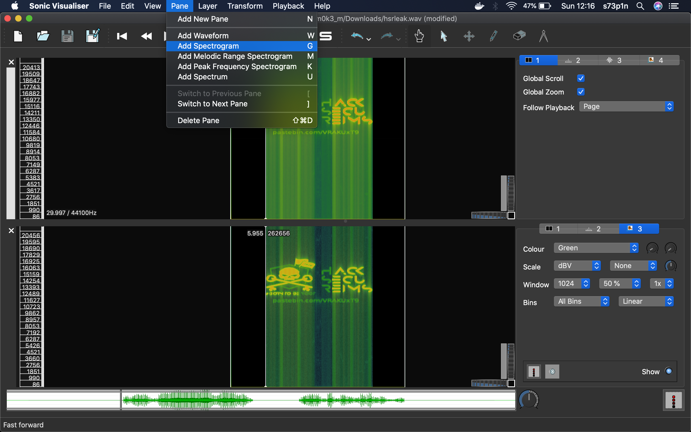
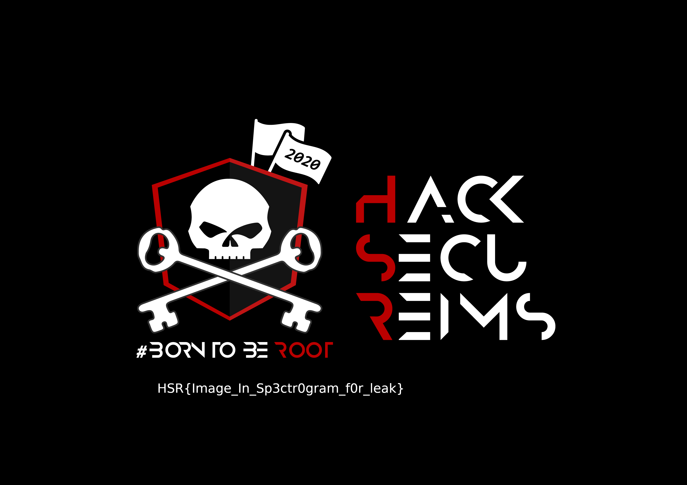

# Leak : 125 points

Unfortunatly, I don't have the challenge description but it was something like : 
"We heard that someone have found a new way of exchanging informations. Find what have been leaked."
and the file hsleak.wav was given.

#### The audio file exploration

Knowing that it was a WAVE audio, I launched the Sonic Visualiser and opened the hsleak.wav file to see the audio spectogram.



We could clear see a pastebin link (hxxps://pastebin.com/VRAKUxT9) which contains some facebook account emails and passwords.
The pastebin was lastely modified in 2017.<br/> 

So it seems like those passwords could be helpful for something. I went back to the audio file to see all contained strings.

```shell
[CTF] (~/HSR/) $ strings -a hsrleak.wav
...
flag.pngUT
...
```
We can suppose that it's a compressed file, let's try to unzip the file.

```shell
[CTF] (~/HSR/) $ unzip hsrleak.wav 
Archive:  hsrleak.wav
warning [hsrleak.wav]:  2645804 extra bytes at beginning or within zipfile
  (attempting to process anyway)
[hsrleak.wav] flag.png password: 
   skipping: flag.png                incorrect password
```

It's a protected zip.

Let's make a dictionary attack to try to unprotect the zip.


```shell
[CTF] (~/HSR/) $ zip2john hsrleak.wav > breakme
```

#### Break the zip password

First of all, I've choosed the classic way and tried to break the protected zip with the rockyou dictionary.

```shell
[CTF] (~/HSR/) $ john --wordlist=/usr/shar/wordlists/rockyou.txt breakme
Using default input encoding: UTF-8
Loaded 1 password hash (PKZIP [32/64])
Will run 2 OpenMP threads
Press 'q' or Ctrl-C to abort, almost any other key for status
0g 0:00:00:02 DONE (2020-02-09 11:58) 0g/s 6639Kp/s 6639Kc/s 6639KC/s !!rebound!!..*7¡Vamos!
Session completed
```

The password did not exist in the rockyou dictionary. Then I tried to break the protected zip with the passwords found with the pastebin link. <br/>

Here is a Quick n'Dirty script to get all passwords. With the pastebin content in pastbin_content.txt and all extracted passwords in dico.txt

```python
[CTF] (~/HSR/) $ cat extract_pwd.py 
file_content = open("pastbin_content.txt", 'r').read().split()
dico = open("dico.txt", 'w')
for usr_pwd in file_content :
    print(usr_pwd)
    if ':' in usr_pwd :
        dico.write(usr_pwd.split(':')[1]+'\n')
    else :
        try :
            dico.write(usr_pwd.split('.com')[1]+'\n')
        except :
            dico.write(usr_pwd+'\n')
```

Now we can use again our beloved john the ripper to break the zip password with a dictionary attack.

```shell
[CTF] (~/HSR/) $ john --wordlist=dico.txt breakme
Using default input encoding: UTF-8
Loaded 1 password hash (PKZIP [32/64])
Will run 2 OpenMP threads
Press 'q' or Ctrl-C to abort, almost any other key for status
3yalh42hl        (hsrleak.wav/flag.png)
1g 0:00:00:00 DONE (2020-02-09 12:13) 33.33g/s 23266p/s 23266c/s 23266C/s joyce1717..khender494
Use the "--show" option to display all of the cracked passwords reliably
Session completed

[CTF] (~/HSR/) $ unzip -P 3yalh42hl hsrleak.wav 
Archive:  hsrleak.wav
warning [hsrleak.wav]:  2645804 extra bytes at beginning or within zipfile
  (attempting to process anyway)
  inflating: flag.png 
```

And we got the flag.



<br>


<br/>
